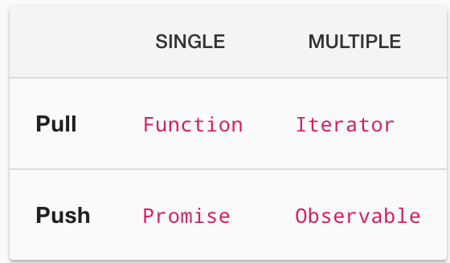
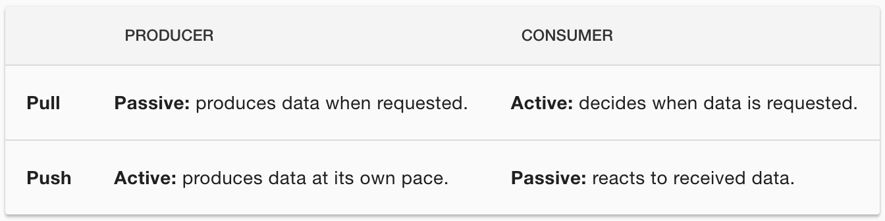

## 주요객체 정리

### Observables

- 여러 값의 지연 푸시 컬렉션으로 다음 표에 누락된 부분을 채운다.
  - [테이블은 push, pull에 대한 일반적인 방식을 나타내고 rxjs의 observables는 일반적인 방식에서 아쉬운 부분을 지원한다는 뜻으로 이해함]

### Pull vs PUsh

pull과 push는 데이터 제공자가 소비자와 통신하는 방법을 설명하는 두 가지 다른 프로토콜.

**Pull**
풀방식은 데이터 생산자로 부터 데이터를 받는 시기를 소비자가 결정한다. 생산자는 소비자가 언제 데이터를 전달받는지 알 수 없음.

- 모든 자바스크립트 함수는 풀방식이다.함수는 데이터 생산자로 이를 호출하는 코드는 리턴 값을 '**가져(pull)**'와 데이터를 소비합니다.

- ES2015는 pull방식의 새로운 유형인 generator함수와 iterators(function \*)를 도입했습니다.
  - iterator.next()코드를 호출하는 곳은 소비자, iterator로 부터 많은 값을 가져온다(생산자)

**Push**
푸시방식은 데이터 생산자가 소비자에게 데이터를 보낼 시점을 결정한다. 소비자는 언제 데이터를 수신하는지 알수 없음.
**오늘날 자바스크립트에서 가장 일반적인 유형의 푸시방식은 Promise입니다.**

---

RxJS는 Observables를 통해 자바스크립트를 위한 새로운 Push방식을 소개합니다. Observable(생산자)은 다양한 값을 Observers(소비자)에게 **push**한다.

- **Function** : 호출시 단일 값을 동기적으로 반환하는 지연 평가된 계산.
- **Generator** : iteration에서 0부터 (잠재적으로) 무한대의 값을 반환하는 지연 평가된 계산.
- **Promise** : 값을 반환할 수도 있고, 혹은 하지 않을 수도 있는 계산
- **Observable** : 동기, 비동기식으로 호출된 시간부터 0 부터 (잠재적으로) 무한대의 값을 반환하는 지연 평가된 계산.

### Observables as generalizations of functions

대중적으로 아는 것과 달리 Obserbable은 EventEmitter, 여러 값에 대한 Promise와도 다르다. RxJS의 Subject를 사용해 멀티캐스트되는 경우를 제외하면 EventEmitter처럼 동작하지 않는다.

### Anatomy of an Observable

Observable은 new 혹은 생성 연산자를 통해 생성되고 Observer로 구독된다.  
Observer에 next/error/complete 알림을 전달한며 폐기될 수 있다.
이러한 Obserbable의 성격 중 일부는 Observer, Subscription과 관련되어 있음.

**Observable 주요 기능**

- Creating Observables
- Subscribing to Observables
- Executing the Observable
- Disposing Observables
